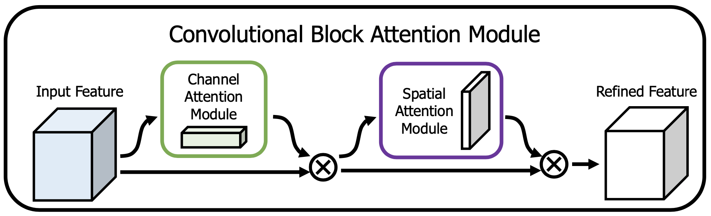

# Self Supervised Domain Adaptation using Adversarial Learning
This repository contains the codes for the Supervised Learning Project taken under [Prof. Biplab Banerjee](https://biplab-banerjee.github.io/) and [Prof. Prabhu Ramachandran](https://www.aero.iitb.ac.in/~prabhu/) during Autumn 2020. 

## Problem Statement
The success of machine learning methods on visual recognition tasks is highly dependent on access to large labeled datasets. Unfortunately, performance often drops significantly when the model is presented with data from a new deployment domain which it did not see in training, a problem known as _dataset shift_. Domain Adaptation techniques are used to transfer source knowledge (from the source domain) and adapt it to novel target domains.

## Dataset
For the purpose of this project, two different Domain Adaptation datasets have been used to test the adaptibility of my model:
* [VisDA 2017 Dataset](http://ai.bu.edu/visda-2017/)
* [Office-Home Dataset](http://hemanthdv.org/OfficeHome-Dataset/)

### VisDA 2017 Dataset
The VisDA dataset contains two different domains (for training), the training and the validation domain with images from 12 different object categories in both the domains. Images in the training domain are synthetic 2D renderings of 3D models generated from different angles and with different lighting conditions, making them easy to label with minimal human intervention. Images in the validation domain are real life images with a varied underlying distribution which makes them quite different from the source domain images. The model is trained on the synthetic images (source-domain) and then validated on the real images (target-domain). The model can then also be tested on a test domain (not done here). The dataset can be downloaded from the above link. 
> Note: The validation domain images provided in the dataset are labelled, however, the problem statement tries to address scenarios where labelled datasets in the target domain are unavailable. Hence, for this project, the model is trained considering the real images in the validation domain as unlabelled. 

  

### Office-Home
The Office-Home dataset is another dataset used for the evaluation of domain adaptation techniques. As compared to the VisDA dataset, Office-Home contains 4 different domains, namely, Artistic images, Clip Art, Product images and Real-World images. For each domain, the dataset contains images of 65 object categories found typically in Office and Home settings. There are a total of 15500 images distributed among 65 different object categories. The dataset can be downloaded from the above link.

  

## Domain Adversarial Neural Network (DANN)
The first part of the model is a Domain Adversarial Neural Network, a Keras and Tensorflow re-implementation of the paper: [Domain Adversarial Training of Neural Networks](https://arxiv.org/pdf/1505.07818.pdf)
> Ganin, Y., Ustinova, E., Ajakan, H., Germain, P., Larochelle, H., Laviolette, F., Marchand, M. and Lempitsky, V., 2016. Domain-adversarial training of neural networks. The Journal of Machine Learning Research, 17(1), pp.2096-2030.

### Environment
Tensorflow: 2.2.0
 Keras: 2.3.1
 Python: 3.7.4

### Network Structure
The DANN network structure includes a deep feature extractor (green), and a deep label predictor (blue), which together form a standard feed-forward architecture. Domain adaptation is achieved by adding a domain classifier (red) connected to the feature extractor via a **gradient reversal layer** that multiplies the gradient by a certain negative constant during backpropagation. Otherwise, the training proceeds in a standard way and minimizes the label prediction loss (for source samples) and the domain classification loss (for all samples). Gradient reversal ensures that the feature distributions over the two domains are made similar (as indistinguishable as possible for the domain classifier), thus resulting in the domain-invariant features.

  

The input to the DANN are features extracted from a pre-trained ResNet50 model, fine-tuned on the particular dataset being used for the project. While feature-extraction, most of the layers in the ResNet architecture are freezed, and only the last few layers are trained. The topmost layer of the ResNet architecture (softmax) is removed, since the features at this layer are then sent through the Attention module, known as the **Convolutional Block Attention Module (CBAM)**.
#### Convolutional Block Attention Module (CBAM)
> Woo, Sanghyun, et al. "[CBAM: Convolutional block attention module](https://openaccess.thecvf.com/content_ECCV_2018/papers/Sanghyun_Woo_Convolutional_Block_Attention_ECCV_2018_paper.pdf)." Proceedings of the European conference on computer vision (ECCV) 2018.
> The codes for CBAM are a Keras and Tensorflow re-implementation of the codes available [here](https://github.com/luuuyi/CBAM.PyTorch).

  

Attention, in Deep Learning, is a technique to give more importance to features with a greater impact on the output, by assigning weights to each feature. These weights can be interpreted as 'importance weights'. The CBAM applies channel and spatial attention to intermediate feature maps in a CNN through two sequential sub-modules. It can be used at every convolutional block or once at the end. In this project, the CBAM is used once on the features extracted from the fine-tuned ResNet50 backbone network. After the features have gone through the CBAM, a GlobalAveragePooling layer is applied resulting in an output dimension of _1 x 1 x 2048_. These features are the final input to the DANN.
> Note: Currently, the codes uploaded in this repo do not implement CBAM and simply use ResNet50 extracted features as an input to the DANN, available for download [here](https://pan.baidu.com/s/1sbuDqWWzwLyB1fFIpo5BdQ) (VisDA) and [here](https://pan.baidu.com/s/1qvcWJCXVG8JkZnoM4BVoGg) (Office-Home). 

### Training and Results
Once the label predictor gets trained on the source domain images and the domain classifier is trained on all image samples (source+target domain), the label predictor is used to generate _pseudo-labels_ for the images in the target domain (only predictions, no training). The threshold value of the confidence of the predicted label is kept at 90%, that is, the predicted label of an image should be greater than or equal to 0.9 probability as compared to other classes.

Once the pseudo-labels of the target domain images have been generated, source domain and target domain image pairs are created for training the second part of the model, the Siamese Network. 

## Siamese Neural Network
The Siamese network is a neural network in which a pair of images are propagated through the same architecture to generate a same dimensional feature space for both the images. Now, if the images belonged to the same class, the 'distance' between the feature spaces should be minimised, and vice-versa for the other case. The 'distance' between feature spaces is the Euclidean Norm (or L2 norm) between the two vectors. Based on this distance, a loss function called as **Contrastive Loss** is used, which achieves the desired objective mentioned above while back-propagating. 

In this way, the Siamese network ensures that the two domains are now even more closer than before, and thus results in better domain adaptation performance as compared to a single model technique. The DANN model resulted in both, adapted domains and psuedo-labels for the target domain images, thus eliminating the need of labelled datasets in the target domain and allowing the use of the same model trained on a single source domain to be used for multiple different target domains (in this case only one target domain is tested, however research on multiple target domains is also available).

